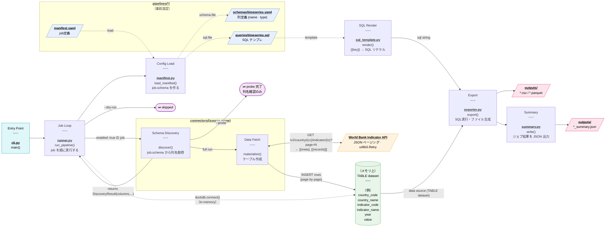

# wdi-pipeline

Manifest-driven batch pipeline that fetches World Development Indicators (WDI)
from the World Bank API, filters them with SQL, and exports to CSV or Parquet.

Built as a production-style Python prototype — connector-agnostic core, DuckDB
for in-process SQL, streaming page ingestion, and no pandas dependency.

---

## Repository layout

```
api-bulk-downloader/
├── wdi_pipeline/                  # installable package (v2)
│   ├── cli.py                     #   argparse entry point
│   ├── runner.py                  #   job loop (dry-run / probe / full)
│   ├── manifest.py                #   YAML loader + validation
│   ├── sql_template.py            #   {{key}} → SQL literal renderer
│   ├── exporter.py                #   DuckDB COPY → CSV / Parquet
│   ├── summary.py                 #   per-job JSON summary
│   ├── logging_setup.py
│   ├── exceptions.py
│   └── connectors/
│       ├── protocol.py            #   ConnectorProtocol, DiscoveryResult
│       └── worldbank_indicator.py #   JSON paging + Session DI
├── pipelines/                     # pipeline definitions (one subdir per pipeline)
│   └── default/                   #   WorldBank WDI pipeline
│       ├── manifest.yaml          #     job definitions
│       ├── queries/
│       │   └── timeseries.sql     #     SQL template
│       └── schemas/
│           └── timeseries.yaml  # column definitions (name + DuckDB type)
├── tests/                         # 30 unit tests
├── archive/
│   └── api_bulk_downloader_v1/    # v1 reference (ZIP/stream approach)
└── pyproject.toml
```

---

## Installation

```bash
pip install -e .
```

This installs the `wdi-pipeline` command and all dependencies
(`requests`, `urllib3`, `duckdb`, `pyyaml`, `python-dotenv`).

---

## Usage

Set defaults in `.env` (optional):

```dotenv
WDI_MANIFEST=pipelines/default/manifest.yaml
WDI_OUTPUT_ROOT=outputs/
```

```bash
# Run with .env defaults (no flags needed)
wdi-pipeline run

# Override manifest or output root at runtime
wdi-pipeline run --manifest pipelines/other/manifest.yaml
wdi-pipeline run --output-root tmp/

# Validate manifest structure — no network calls
wdi-pipeline run --dry-run

# Discover column schema only — no data fetched
wdi-pipeline run --probe

# Run a single job
wdi-pipeline run --only gdp_jpn

# Verbose logging
wdi-pipeline run --log-level DEBUG
```

Resolution order:

| Setting | Priority 1 | Priority 2 | Priority 3 |
|---|---|---|---|
| manifest path | `--manifest` | `WDI_MANIFEST` | error |
| output root | `--output-root` | `WDI_OUTPUT_ROOT` | manifest default |

| Mode | `discover()` | `materialize()` | SQL / export |
|------|:---:|:---:|:---:|
| normal | ✅ | ✅ | ✅ |
| `--dry-run` | — | — | — |
| `--probe` | ✅ | — | — |

---

## Manifest

Jobs are declared in `pipelines/default/manifest.yaml`:

```yaml
defaults:
  output_root: outputs/      # base directory for all exports
  export_format: csv         # default format (csv or parquet)

jobs:
  - name: gdp_jpn
    source:
      type: worldbank_indicator
      params:
        indicator_code: NY.GDP.MKTP.CD
        country_code: JPN        # ISO 3166-1 alpha-3, or "all"
    sql:
      file: queries/timeseries.sql
      params:
        min_year: "2000"         # injected as SQL literal via {{min_year}}
    export:
      format: parquet            # overrides default
      filename: gdp_jpn          # output: outputs/gdp_jpn.parquet
    schema:
      file: schemas/timeseries.yaml  # column definitions

  - name: salesforce_opps
    enabled: false               # skipped in all modes
    ...
```

`source.params` are passed as keyword arguments to the connector constructor.
`sql.params` replace `{{key}}` placeholders in the SQL file.
`schema.file` points to a YAML file that defines the dataset columns and their DuckDB types.

---

## Schema files

Column definitions are declared in separate YAML files under `schemas/`:

```yaml
# schemas/timeseries.yaml
columns:
  - name: country_code
    type: VARCHAR
  - name: year
    type: INTEGER
  - name: value
    type: DOUBLE
  # ...
```

Each entry requires `name` (column name) and `type` (DuckDB type string).
The schema is loaded at manifest-parse time and used to:

- build the `CREATE TABLE dataset (...)` DDL in `materialize()`
- report available columns in `discover()`

---

## SQL templates

SQL files under `queries/` may contain `{{key}}` placeholders:

```sql
SELECT country_code, country_name, indicator_code, indicator_name, year, value
FROM dataset
WHERE year >= {{min_year}}
ORDER BY country_code, year
```

`{{key}}` is replaced with a typed SQL literal before execution:
integers and floats are embedded bare; other strings are single-quoted
with `'` escaped. Parameters come from `sql.params` in the manifest
(operator-controlled config, not user input).

The materialized API data is always available as a DuckDB table named `dataset`.

---

## Architecture

### Data flow per job



### Connector protocol

```python
class ConnectorProtocol(Protocol):
    def discover(self, job) -> DiscoveryResult: ...
    def materialize(self, job, conn: duckdb.DuckDBPyConnection) -> None: ...
```

`runner.py` calls both methods for every enabled job.
`discover()` is always a no-network call — it reads column names from `job.schema`.
`materialize()` builds the `CREATE TABLE` DDL dynamically from `job.schema` and
streams API pages directly into a per-job DuckDB connection — no full dataset is
held in memory.

### Per-job isolation

Each job gets a fresh `duckdb.connect()` that is closed after export.
Failure in one job logs an error and continues to the next.

### Retry

`WorldBankIndicatorConnector` uses `urllib3.Retry` with
`backoff_factor=1.0` on HTTP 429, 500, 502, 503, 504 (up to 3 attempts).

---

## Output

After a successful run, `outputs/` contains:

```
outputs/
├── gdp_jpn.parquet
├── gdp_jpn_summary.json
├── population_latam.csv
└── population_latam_summary.json
```

Each `_summary.json` records job name, status, start/end time,
duration, row count, export path, discovery columns, and any error message.

---

## Testing

```bash
pytest tests/ -v
```

30 unit tests. HTTP is never called in tests — `WorldBankIndicatorConnector`
accepts an injected `session` argument, and tests pass a `FakeSession`
that returns pre-defined page payloads.

---

## Archive

`archive/api_bulk_downloader_v1/` is the original v1 implementation:
a streaming HTTP downloader that fetched ZIP archives and counted CSV rows.
It is kept for reference only and is not installed by `pyproject.toml`.
