# wdi-pipeline

Manifest-driven batch pipeline that fetches World Development Indicators (WDI)
from the World Bank API, filters them with SQL, and exports to CSV or Parquet.

Built as a production-style Python prototype — connector-agnostic core, DuckDB
for in-process SQL, streaming page ingestion, and no pandas dependency.

---

## Repository layout

```
api-bulk-downloader/
├── wdi_pipeline/                  # installable package (v2)
│   ├── cli.py                     #   argparse entry point
│   ├── runner.py                  #   job loop (dry-run / probe / full)
│   ├── manifest.py                #   YAML loader + validation
│   ├── sql_template.py            #   {{key}} → SQL literal renderer
│   ├── exporter.py                #   DuckDB COPY → CSV / Parquet
│   ├── summary.py                 #   per-job JSON summary
│   ├── logging_setup.py
│   ├── exceptions.py
│   └── connectors/
│       ├── protocol.py            #   ConnectorProtocol, DiscoveryResult
│       └── worldbank_indicator.py #   JSON paging + Session DI
├── queries/
│   └── worldbank/
│       └── timeseries.sql         # default SQL template
├── configs/
│   └── manifest.yaml              # job definitions
├── tests/                         # 30 unit tests
├── archive/
│   └── api_bulk_downloader_v1/    # v1 reference (ZIP/stream approach)
└── pyproject.toml
```

---

## Installation

```bash
pip install -e .
```

This installs the `wdi-pipeline` command and all dependencies
(`requests`, `urllib3`, `duckdb`, `pyyaml`, `python-dotenv`).

---

## Usage

```bash
# Validate manifest structure — no network calls
wdi-pipeline run --manifest configs/manifest.yaml --dry-run

# Discover column schema only — no data fetched
wdi-pipeline run --manifest configs/manifest.yaml --probe

# Run all enabled jobs
wdi-pipeline run --manifest configs/manifest.yaml

# Run a single job
wdi-pipeline run --manifest configs/manifest.yaml --only gdp_jpn

# Verbose logging
wdi-pipeline run --manifest configs/manifest.yaml --log-level DEBUG
```

| Mode | `discover()` | `materialize()` | SQL / export |
|------|:---:|:---:|:---:|
| normal | ✅ | ✅ | ✅ |
| `--dry-run` | — | — | — |
| `--probe` | ✅ | — | — |

---

## Manifest

Jobs are declared in `configs/manifest.yaml`:

```yaml
defaults:
  output_root: outputs/      # base directory for all exports
  export_format: csv         # default format (csv or parquet)

jobs:
  - name: gdp_jpn
    source:
      type: worldbank_indicator
      params:
        indicator_code: NY.GDP.MKTP.CD
        country_code: JPN        # ISO 3166-1 alpha-3, or "all"
    sql:
      file: queries/worldbank/timeseries.sql
      params:
        min_year: "2000"         # injected as SQL literal via {{min_year}}
    export:
      format: parquet            # overrides default
      filename: gdp_jpn          # output: outputs/gdp_jpn.parquet

  - name: salesforce_opps
    enabled: false               # skipped in all modes
    ...
```

`source.params` are passed as keyword arguments to the connector constructor.
`sql.params` replace `{{key}}` placeholders in the SQL file.

---

## SQL templates

SQL files under `queries/` may contain `{{key}}` placeholders:

```sql
SELECT country_code, country_name, indicator_code, indicator_name, year, value
FROM dataset
WHERE year >= {{min_year}}
ORDER BY country_code, year
```

`{{key}}` is replaced with a typed SQL literal before execution:
integers and floats are embedded bare; other strings are single-quoted
with `'` escaped. Parameters come from `sql.params` in the manifest
(operator-controlled config, not user input).

The materialized API data is always available as a DuckDB table named `dataset`.

---

## Architecture

### Data flow per job

```mermaid
flowchart LR
    CLI["Entry Point<br>-----<br><br><u><b>cli.py</b></u><br>run_pipeline()"]

    %% inputs (auxiliary)
    subgraph PRE ["事前設定"]
        MANIFEST[/"<u><b>configs/manifest.yaml</b></u><br>詳細設定"/]
        SQL_FILE[/"<u><b>queries/worldbank/timeseries.sql</b></u><br>SQLテンプレ"/]
    end
    %% auxiliary (dashed) to show "inputs"
    MANIFEST -.-> CLI
    MANIFEST -.-> SQL_FILE


    %% runtime flow
    CLI -->|"--dry-run"| SKIP(["⏭ skipped"])
    CLI --> CONN

    subgraph CONN ["<u><b>connectors/worldbank_indicator.py</b></u>"]
        DISC["Schema Discovery<br>-----<br><br><u><b>worldbank_indicator.py</b></u><br>discover()<br>固定スキーマ・ネットワーク不要"]
        MAT["Data Fetch<br>-----<br><br><u><b>worldbank_indicator.py</b></u><br>materialize()<br>ページループ"]
        DISC -->|"--probe"| PROBED(["⏭ probe完了<br>カラム確認のみ"])
        DISC -->|full run| MAT
    end

    MAT <-->|"GET /v2/country/{cc}/indicator/{ic}?page=N<br>← [{meta}, [{records}]]"| WB[/"<u><b>World Bank Indicator API</b></u><br>JSONページング · urllib3.Retry"/]

    MAT -->|"INSERT rows<br>(page by page)"| DS

    subgraph DUCK ["<u><b>DuckDB</b></u>（ジョブごと・インプロセス）"]
        DS[("TABLE dataset<br>-----<br>country_code · country_name<br>indicator_code · indicator_name<br>year · value")]
    end

    %% SQL render
    DS --> RENDER["SQL Render<br>-----<br><br><u><b>sql_template.py</b></u><br>render()<br>{{key}} → SQLリテラル"]
    RENDER --> EXPORT["Export<br>-----<br><br><u><b>exporter.py</b></u><br>export()<br>CREATE TEMP VIEW → COPY TO file"]

    %% outputs
    EXPORT --> OUT_DATA[/"<u><b>outputs/</b></u><br>*.csv / *.parquet"/]
    EXPORT --> OUT_SUM[/"<u><b>outputs/</b></u><br>*_summary.json"/]

    classDef entry   fill:#e0f7fa,stroke:#0097a7, color:#000
    classDef file    fill:#e8f0fe,stroke:#4a7fcb, color:#000
    classDef ext     fill:#fff3e0,stroke:#e6a817, color:#000
    classDef db      fill:#e8f5e9,stroke:#43a047, color:#000
    classDef term    fill:#f3e5f5,stroke:#8e24aa, color:#000
    classDef out     fill:#fce4ec,stroke:#e91e63, color:#000

    class CLI entry
    class MANIFEST,SQL_FILE file
    class WB ext
    class DS db
    class SKIP,PROBED term
    class OUT_DATA,OUT_SUM out
```



### Connector protocol

```python
class ConnectorProtocol(Protocol):
    def discover(self, job) -> DiscoveryResult: ...
    def materialize(self, job, conn: duckdb.DuckDBPyConnection) -> None: ...
```

`runner.py` calls both methods for every enabled job.
`discover()` is always a no-network call (returns a fixed schema).
`materialize()` streams API pages directly into a per-job DuckDB connection —
no full dataset is held in memory.

### Per-job isolation

Each job gets a fresh `duckdb.connect()` that is closed after export.
Failure in one job logs an error and continues to the next.

### Retry

`WorldBankIndicatorConnector` uses `urllib3.Retry` with
`backoff_factor=1.0` on HTTP 429, 500, 502, 503, 504 (up to 3 attempts).

---

## Output

After a successful run, `outputs/` contains:

```
outputs/
├── gdp_jpn.parquet
├── gdp_jpn_summary.json
├── population_latam.csv
└── population_latam_summary.json
```

Each `_summary.json` records job name, status, start/end time,
duration, row count, export path, discovery columns, and any error message.

---

## Testing

```bash
pytest tests/ -v
```

30 unit tests. HTTP is never called in tests — `WorldBankIndicatorConnector`
accepts an injected `session` argument, and tests pass a `FakeSession`
that returns pre-defined page payloads.

---

## Archive

`archive/api_bulk_downloader_v1/` is the original v1 implementation:
a streaming HTTP downloader that fetched ZIP archives and counted CSV rows.
It is kept for reference only and is not installed by `pyproject.toml`.
