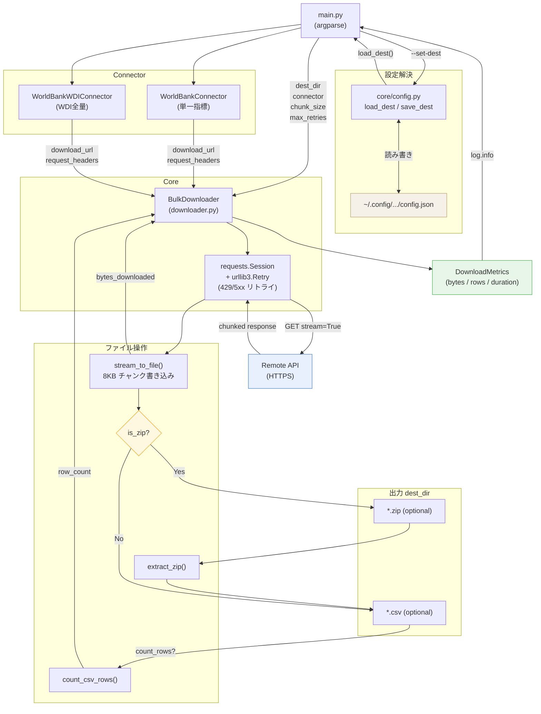

# API Bulk Downloader

A production-style Python prototype for safely downloading large datasets via API.

## Project Structure

```
api_bulk_downloader/
├── core/
│   ├── config.py       # Persistent output-dir config (load/save ~/.config/.../config.json)
│   ├── downloader.py   # Streaming downloader with retry/backoff (connector-agnostic)
│   ├── file_utils.py   # Chunk writes, ZIP extraction, primary CSV selection, row counting
│   └── logger.py       # Logging setup and DownloadMetrics dataclass
├── connectors/
│   └── worldbank.py    # World Bank Indicators API connector
├── main.py             # CLI entry point
tests/
└── test_file_utils.py  # Unit tests for file_utils (choose_primary_csv)
```

## Quick Start

```bash
pip install -r requirements.txt

# Download World Bank GDP data (default, saves to ./downloads)
python -m api_bulk_downloader.main

# Persist an output directory (written to ~/.config/api_bulk_downloader/config.json)
python -m api_bulk_downloader.main --set-dest /data/worldbank

# Specify a different indicator and output directory
python -m api_bulk_downloader.main --indicator SP.POP.TOTL --dest data/

# Full options
python -m api_bulk_downloader.main --help
```

## Architecture

### Separation of Concerns

| Layer | Responsibility |
|-------|---------------|
| `core/config.py` | Persist and load output directory (`~/.config/.../config.json`) |
| `core/downloader.py` | HTTP streaming, retry logic, orchestration — no API knowledge |
| `core/file_utils.py` | File I/O: chunked writes, ZIP extraction, primary CSV selection, row counting |
| `core/logger.py` | Logging config, `DownloadMetrics` (start/end/duration/bytes/rows) |
| `connectors/*` | API-specific URL building and authentication headers |

### Connector Protocol

Each connector exposes only two properties:

```python
@property
def download_url(self) -> str: ...      # full URL to the resource
@property
def request_headers(self) -> dict: ...  # HTTP headers (auth, Accept, etc.)
```

`BulkDownloader` depends on this protocol, not on concrete connector classes,
making it trivial to swap in the Salesforce connector later without touching
any core code.

### Retry Strategy

`BulkDownloader` uses `urllib3.Retry` with exponential backoff:

```
wait = backoff_factor × 2^(attempt − 1)
```

Retries on HTTP 429, 500, 502, 503, 504.

### Metrics Logged

| Field | Description |
|-------|-------------|
| `start_time` | Unix timestamp when download began |
| `end_time` | Unix timestamp when download finished |
| `duration_seconds` | Wall-clock duration |
| `bytes_downloaded` | Raw bytes written to disk |
| `row_count` | CSV data rows (header excluded); `n/a` for non-CSV |

### Data Flow


