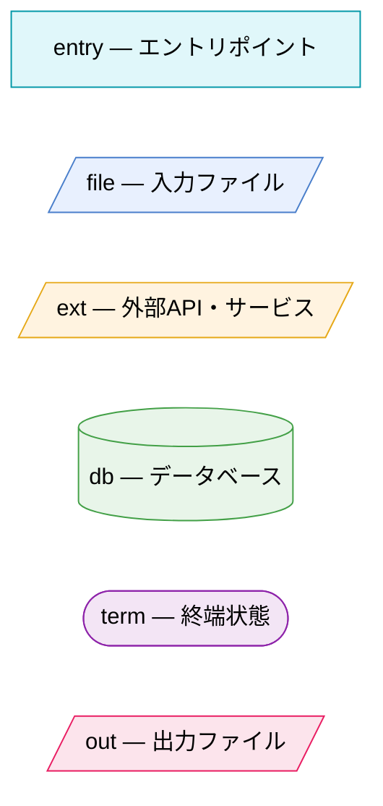
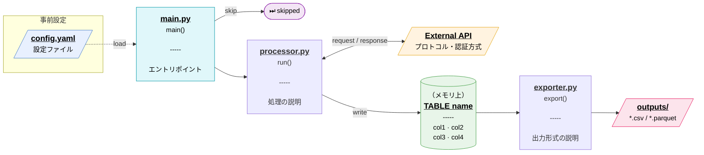

# Mermaid 作図規約

データフロー図を新規作成・更新するときの規約。どのプロジェクトでも使える。

---

## 1. 宣言

```
flowchart LR
```

**方向は LR**（左 → 右）を基本とする。時系列・データの流れを左から右へ読ませる。
処理ステップが多くて縦に伸びる場合は `TD`（上 → 下）に切り替えてよい。

---

## 2. ノード形状と役割

| 役割 | 形状 | Mermaid 記法 |
|------|------|-------------|
| 処理・コード | 四角 | `NODE["..."]` |
| ファイル・外部リソース | 台形（両端斜め） | `NODE[/"..."/]` |
| データベース / テーブル | シリンダー | `NODE[("...")]` |
| 終端状態（スキップ・分岐終了） | 角丸 | `NODE(["..."])` |

---

## 3. ラベルフォーマット

### 3-a. 処理ノード（四角）

**ファイル名が明確なモジュールノード：**

```
"<u><b><big>module.py</big></u></b><br>function()<br><br>-----<br><br>一行説明"
```

| 行 | 内容 | ルール |
|----|------|--------|
| 1 | ファイル名 | `<u><b><big>module.py</big></u></b>` |
| 2 | 関数・メソッド名 | `run()`, `execute()` など |
| 3 | 空行 + 区切り線 + 空行 | `<br><br>-----<br><br>` |
| 4 | 短い説明 | 日本語可 |

**例（汎用）:**
```
PROC["<u><b><big>processor.py</big></u></b><br>run()<br><br>-----<br><br>入力を変換して出力"]
```

**サブグラフ内などファイル名を省略するメソッドノード：**

```
"<i>役割名</i><br><br>function()<br><br>-----<br><br>一行説明"
```

| 行 | 内容 | ルール |
|----|------|--------|
| 1 | 役割名（イタリック・英語） | `<i>Data Fetch</i>`, `<i>Schema Discovery</i>` など |
| 2 | 空行 + 関数・メソッド名 | `<br><br>materialize()` など |
| 3 | 空行 + 区切り線 + 空行 | `<br><br>-----<br><br>` |
| 4 | 短い説明 | 日本語可 |

**例（汎用）:**
```
MAT["<i>Data Fetch</i><br><br>materialize()<br><br>-----<br><br>テーブル作成"]
```

### 3-b. ファイル・外部リソースノード（台形）

```
[/"<u><b><big>名前またはパス</big></u></b><br>一行説明"/]
```

**例（汎用）:**
```
CFG[/"<u><b><big>config.yaml</big></u></b><br>設定ファイル"/]
API[/"<u><b><big>External API</big></u></b><br>REST · リトライあり"/]
```

### 3-c. DB ノード（シリンダー）

```
[("補足（メモリ上など）<br><u><b><big>TABLE name</big></u></b><br>-----<br>col1 · col2<br>col3 · col4")]
```

**例（汎用）:**
```
TBL[("（メモリ上）<br><u><b><big>TABLE records</big></u></b><br>-----<br>id · name<br>created_at · value")]
```

### 3-d. 終端ノード（角丸）

短くてよい。絵文字で状態を示す。

```
SKIP(["⏭ skipped"])
DONE(["✅ 完了"])
ERR(["❌ エラー終了"])
```

---

## 4. エッジ（矢印）スタイル

| 用途 | 記法 | 例 |
|------|------|----|
| メインのデータフロー | `-->` | `A --> B` |
| 補助入力（設定ファイルなど） | `-.->` | `CFG -.->|"load"| ENTRY` |
| リクエスト / レスポンス（双方向） | `<-->` | `PROC <-->|"GET / 200 OK"| API` |

- エッジラベルは `|"ラベル"|` で指定する
- ラベル内の改行は `<br>` を使う
- 長くなるときは 2 行まで（それ以上はノード側に書く）

---

## 5. 色クラス



| クラス | 色 | 使いどころ |
|--------|----|-----------|
| `entry` | ティール | CLI・エントリポイント・スタート地点 |
| `file` | 青 | 入力ファイル（YAML・JSON・SQL など） |
| `ext` | オレンジ | 外部 API・外部サービス・SaaS |
| `db` | 緑 | データベース・インメモリテーブル・キャッシュ |
| `term` | 紫 | 分岐終端（スキップ・中断・早期リターン） |
| `out` | ピンク | 出力ファイル・最終成果物 |

### コピペ用（毎回図の末尾に貼る）

```
classDef entry fill:#e0f7fa,stroke:#0097a7,color:#000
classDef file  fill:#e8f0fe,stroke:#4a7fcb,color:#000
classDef ext   fill:#fff3e0,stroke:#e6a817,color:#000
classDef db    fill:#e8f5e9,stroke:#43a047,color:#000
classDef term  fill:#f3e5f5,stroke:#8e24aa,color:#000
classDef out   fill:#fce4ec,stroke:#e91e63,color:#000

class <エントリノードID> entry
class <ファイルノードID群> file
class <外部APIノードID> ext
class <DBノードID> db
class <終端ノードID群> term
class <出力ノードID群> out
```

---

## 6. サブグラフ

モジュール・レイヤー・サービス単位でノードをまとめる。

```
subgraph GRP ["<u><b>module.py</b></u>"]
    A["..."]
    B["..."]
end

subgraph GRP2 ["レイヤー名（補足）"]
    C[("...")]
end
```

- ラベルには `<u><b>ファイル名</b></u>` または日本語のレイヤー名を使う
- 内部にノードが 1 つだけのときはサブグラフ不要

---

## 7. コメント

セクションの区切りに `%%` コメントを入れる。

```
%% inputs (auxiliary)
%% runtime flow
%% processing
%% outputs
```

---

## 8. 全体テンプレート

新しい図を作るときのスケルトン。`<...>` の部分を置き換えて使う。


